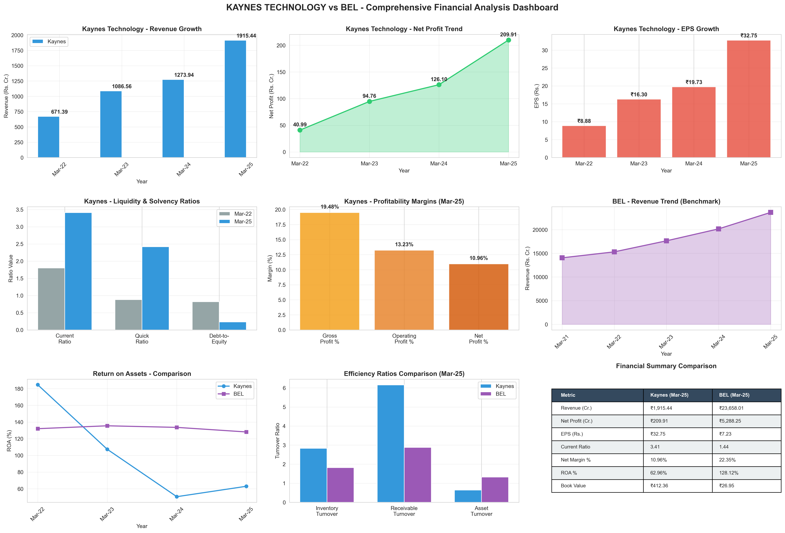

# 📊 Kaynes Technology Financial Dashboard

A comprehensive, interactive financial analysis dashboard comparing **Kaynes Technology Ltd** vs **Bharat Electronics Ltd (BEL)** built with **Streamlit** and **Plotly**.



[](https://www.python.org/downloads/)
[](https://streamlit.io)
[](LICENSE)

## ✨ Features

### 📈 7 Comprehensive Analysis Tabs
1. **Executive Summary** — KPIs, Financial Health Scores (0-100), Revenue & Profit Trends, EPS & Book Value Comparisons
2. **Liquidity Analysis** — Current, Quick, and Cash Ratios, A-F Grade Rating System, Multi-year Trend Analysis, Radar Charts
3. **Solvency Analysis** — Debt-to-Equity Ratios, Times Interest Earned, Debt Service Coverage
4. **Profitability Analysis** — Gross/Operating/Net Profit Margins, ROA, Waterfall Charts
5. **Efficiency Analysis** — Inventory Turnover, Receivables Turnover, Asset Turnover Ratios
6. **DuPont Analysis** — 3-Point ROE Decomposition, Component Breakdown, Waterfall Charts
7. **Comparative Scorecard** — Side-by-side Metrics, Performance Winners, Strength Highlights

### 🎯 Interactive Features
- 📅 Year Selection (2022-2025)
- 📊 Forecast Projections
- 🎚️ Benchmark Comparisons
- 🤖 AI-Generated Narratives
- 🎨 20+ Interactive Plotly Visualizations
- 📱 Responsive Design

## 🚀 Quick Start

### Prerequisites
- Python 3.9+
- pip package manager

### Installation
```bash
# Clone the repository
git clone https://github.com/palchandra1258-afk/Dashboard_Finance.git
cd Dashboard_Finance

# Install dependencies
pip install -r requirements.txt

# Run the dashboard
streamlit run financial_dashboard.py
```

The dashboard will open automatically at `http://localhost:8501`.

## 📦 Tech Stack
- **Python** — Core language
- **Streamlit** — Web framework for data apps
- **Plotly** — Interactive visualizations
- **Pandas / NumPy / SciPy** — Data processing & numerical computing

## 🏗️ Project Structure
```
Dashboard_Finance/
├── financial_dashboard.py   # Main Streamlit application
├── data_extractor.py        # Excel data extraction module
├── financial_calculator.py  # Financial metrics calculator
├── chart_components.py      # Plotly visualization components
├── analyze_excel.py         # Excel analysis utilities
├── detailed_analysis.py     # Detailed financial analysis
├── visualize_analysis.py    # Visualization utilities
├── test_dashboard_data.py   # Test suite
├── verify_deployment.py     # Deployment verification
├── requirements.txt         # Python dependencies
├── KAYNES_FINANCIAL_ANALYSIS_COMPONENTS.md  # Data analysis documentation
├── QUICKSTART.md            # Quick setup guide
└── README.md                # This file
```

## 💻 Usage
```bash
# Start the dashboard
streamlit run financial_dashboard.py

# Run on a custom port
streamlit run financial_dashboard.py --server.port 8502
```

## 🧪 Testing
```bash
python test_dashboard_data.py
python verify_deployment.py
```

## 📈 Key Insights

### Kaynes Technology Ltd (FY 2025)
- Revenue: ₹1,915.44 Cr
- Net Profit: ₹177.96 Cr
- EPS: ₹57.37
- Current Ratio: 3.41 (Grade: A)
- Revenue CAGR: 41.83%

### Bharat Electronics Ltd (FY 2025)
- Revenue: ₹18,600 Cr
- Net Profit: ₹3,773.42 Cr
- EPS: ₹76.43
- Net Profit Margin: 20.29%

## 🌐 Deployment
This app can be deployed for free on [Streamlit Community Cloud](https://share.streamlit.io) by connecting this repository and setting the main file to `financial_dashboard.py`.

Docker deployment is also supported via the included `Dockerfile`.

## 📄 License
This project is licensed under the MIT License — see the [LICENSE](LICENSE) file for details.

## 🙏 Acknowledgments
- Data sourced from [Moneycontrol.com](https://www.moneycontrol.com/)
- Built with [Streamlit](https://streamlit.io/) and [Plotly](https://plotly.com/)

## 📞 Contact
**palchandra1258-afk** — [GitHub](https://github.com/palchandra1258-afk)

**Project Link**: [https://github.com/palchandra1258-afk/Dashboard_Finance](https://github.com/palchandra1258-afk/Dashboard_Finance)
